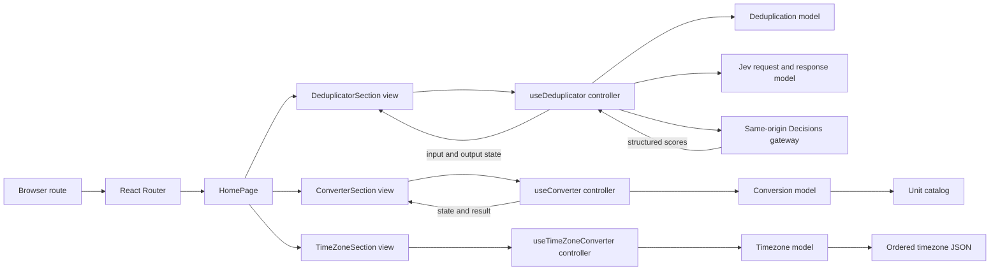
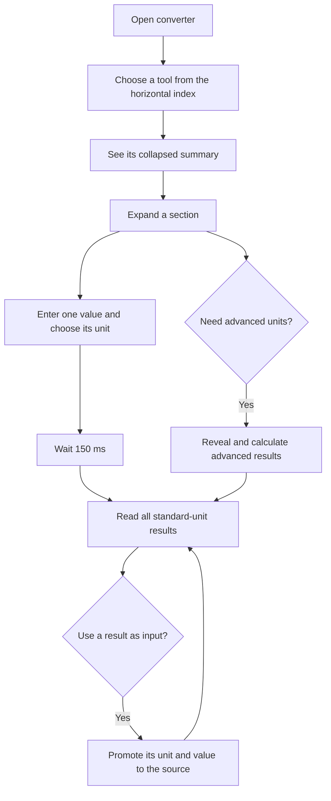
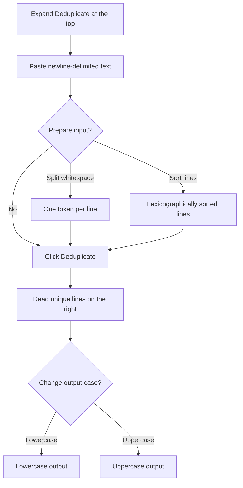
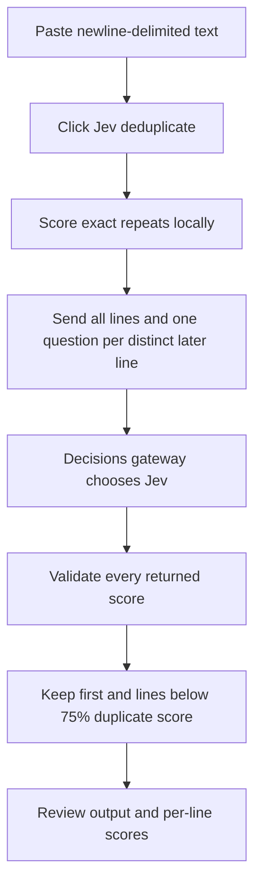
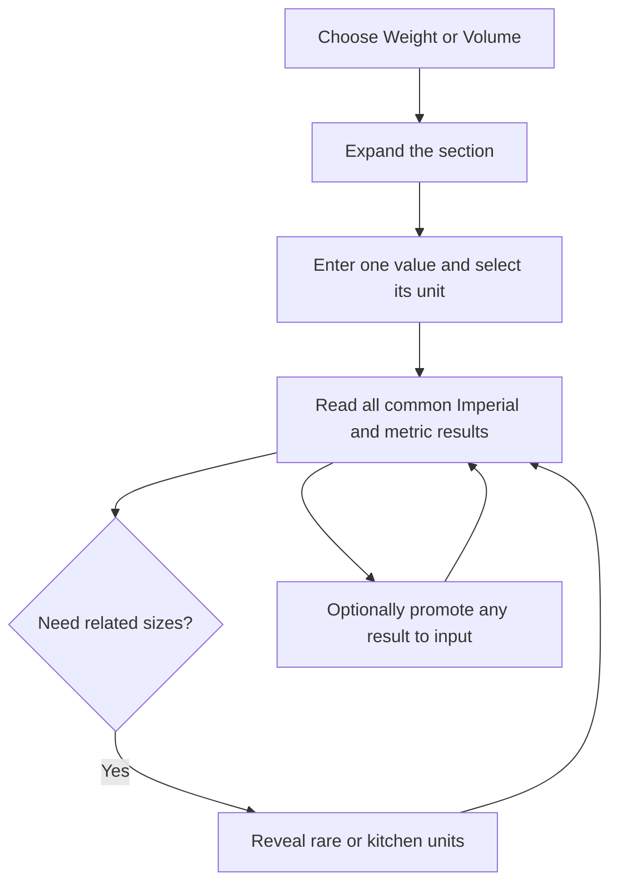
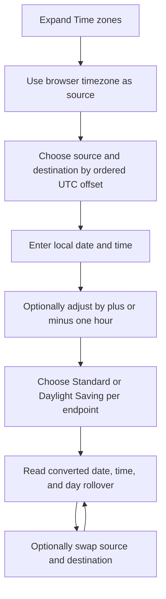

# Architecture

The converter is a client-only React and TypeScript application under `app/`.
The immutable requirements and design inputs remain under `KERNEL/`; derived
behavior and validation contracts live under `SPEC/` and `VALIDATION/`.

## System design

- `models/` owns the unit catalog, parsing, validation, conversion, and result
  formatting, plus the pure text deduplication operations. It has no React or
  Material UI dependency.
- `controllers/` owns per-section input state, the 150 ms debounce, the derived
  result collection, advanced-unit visibility, and per-result promotion. The
  deduplicator controller owns its separate input and output state.
- `views/` owns Material UI presentation and delegates all conversion decisions.
- `App.tsx` preserves the scaffold's `/` and `/:app` routes so later milestones
  can add route-specific behavior without replacing the application shell.
- `App.tsx` also owns the horizontal tool index and milestone ordering. The shared
  footer remains a presentation component without domain behavior.
- The timezone domain uses a separate controller and model because date rollover,
  two independently configured endpoints, and fixed UTC offsets do not fit the
  unit-conversion abstraction.
- The deduplicator uses exact string comparisons and preserves the first
  occurrence order. Its optional input transformations run before the explicit
  Deduplicate action; case controls transform only the current output.
- Jev deduplication sends the complete list once to `/api/decisions`. The
  browser supplies `state` and native `noul` questions, while the gateway owns
  the provider key and model. Exact repeats are scored locally. The Jev model
  validates every returned score before the controller updates the output.

All categories use a canonical base unit. Scaled units convert to and from that
base; temperature uses affine conversion functions because it has an offset. The
controller calculates every visible unit other than the selected input, so one
source produces a consistent result list without duplicating conversion logic.
Weight uses kilograms and volume uses liters as their canonical bases. The result
formatter detects compact repeating patterns while retaining exact small values.

## User journey

## Deduplicator journey

Blank lines are omitted, CRLF and LF are treated alike, and all other line
whitespace is significant. Editing or transforming input clears the prior output
until Deduplicate is clicked again.

## Jev deduplication journey

The request has O(n) question records and uses one network round trip. It avoids
explicit pair requests, while the provider may still compare many line pairs
internally. A pending request is canceled when input changes or exact
deduplication runs. Gateway errors do not silently replace the output with an
exact result.

## Milestone 3 journey

US and Imperial liquid measures are labeled separately because their gallons and
fluid ounces have different sizes. Common cross-system results remain visible;
advanced mode limits the longer tail of kitchen and extreme weight units.

## Extension points

Milestone 4's calculator has history state and should remain a separate domain
model rather than being forced into the unit- or timezone-conversion abstractions.

## Timezone journey

The picker is offset-first rather than alphabetic so users can scan the direction
and magnitude of a conversion. Recognizable region labels remain in each option.
Daylight Saving controls are independent because source and destination may enter
or leave daylight time on different dates. The catalog is deterministic and
offline; it intentionally does not claim historical IANA-rule accuracy.

## Validation and operational notes

Vitest model tests are table-driven. React Testing Library verifies simultaneous
standard outputs, advanced-result disclosure, debounced live calculation,
per-result promotion, timezone selection, Standard Time defaults, hour
adjustments, tool navigation, Weight disclosure, footer links, and deduplication
controls through accessible controls.
`npm run build` performs strict TypeScript compilation before creating the Vite
bundle.

As of July 31, 2026, `npm audit` reports an advisory in React Router's React
Server Components mode. This application is a client-only Vite SPA and does not
enable that mode. The current router version is retained because npm's suggested
downgrade is affected by older router advisories; update when a patched release
is available.
