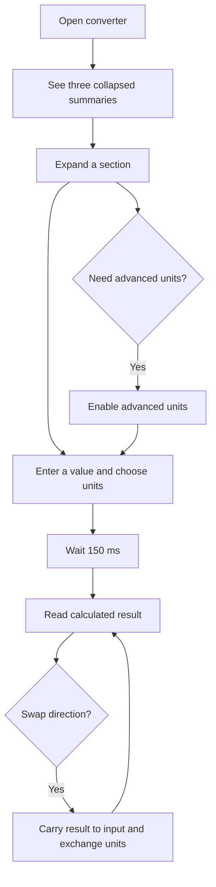

# Architecture

The converter is a client-only React and TypeScript application under `app/`.
The immutable requirements and design inputs remain under `KERNEL/`; derived
behavior and validation contracts live under `SPEC/` and `VALIDATION/`.

## System design

- `models/` owns the unit catalog, parsing, validation, conversion, and result
  formatting. It has no React or Material UI dependency.
- `controllers/` owns per-section input state, the 150 ms debounce, advanced-unit
  visibility, and swapping behavior.
- `views/` owns Material UI presentation and delegates all conversion decisions.
- `App.tsx` preserves the scaffold's `/` and `/:app` routes so later milestones
  can add route-specific behavior without replacing the application shell.

All categories use a canonical base unit. Scaled units convert to and from that
base; temperature uses affine conversion functions because it has an offset.

## User journey

## Extension points

Milestone 2 timezone conversion can add a category-specific model and view while
reusing the routed page and collapsible-section pattern. Milestone 3's calculator
has history state and should remain a separate domain model rather than being
forced into the unit-conversion abstraction.

## Validation and operational notes

Vitest model tests are table-driven. React Testing Library verifies advanced-unit
disclosure, debounced live calculation, and swapping through accessible controls.
`npm run build` performs strict TypeScript compilation before creating the Vite
bundle.

As of July 31, 2026, `npm audit` reports an advisory in React Router's React
Server Components mode. This application is a client-only Vite SPA and does not
enable that mode. The current router version is retained because npm's suggested
downgrade is affected by older router advisories; update when a patched release
is available.
